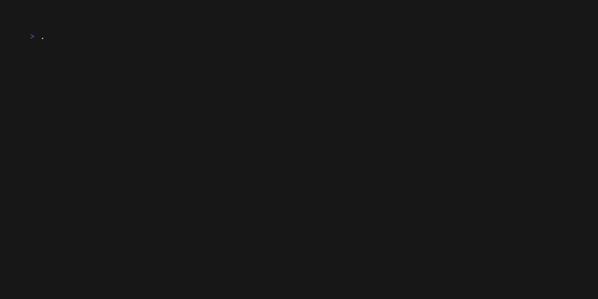

# cligen 


[](https://twinsnes.github.io/cligen/docs)


Cligen is a command line tool to generate go cli applications with a set of sane defaults, including ci/cd and release management. It takes a fair bit of time setting up the basics when building a new cli application, and this tool aims to make that process easier.



Check out the quickstart to get started: https://twinsnes.github.io/cligen/docs/quickstart/

## Included features

- [x] Multiple scaffolds, basic and interactive prompts using a TUI
- [x] Automated Release management using goreleaser
- [x] Automated SBOM generation
- [x] Automated release notes based on [Conventional Commits](https://www.conventionalcommits.org/en/v1.0.0/)
- [x] Automated Homebrew release generation using goreleaser
- [x] Built in Docs website using Hugo with the Lotus-Docs theme, and released to github pages
- [x] Automated Demo generation using vhs 
- [x] CI workflows for linting, testing, and security scanning
- [x] Templates for issues and pull requests

## Why did I make this?
I found myself writing quite a few cli tools, and it was always the same boilerplate over and over again, so I decided to create a tool to generate it for me. I could use an LLM to generate a lot of the structure, but I also wanted to make sure I had an opinionated and tested scaffold around building and releasing the app. So I've put together a tool that does it all for me. 

This way I have a well-structured base to build on, and I can focus on building the actual app.

I hope that you find it useful, and if you have any feedback or suggestions, please feel free to open an issue or PR.

## Installation

Install using homebrew

```shell
brew install twinsnes/tap/cligen
```

This makes cliegen available on your path and works around the MacOS Notarization requirement.

Other installation methods can be found in the docs: https://twinsnes.github.io/cligen/docs/install/

## Usage

Call `cligen new` in the folder you would like to create a new cli application.

Details on usage can be found in the docs: https://twinsnes.github.io/cligen/docs/quickstart/#usage